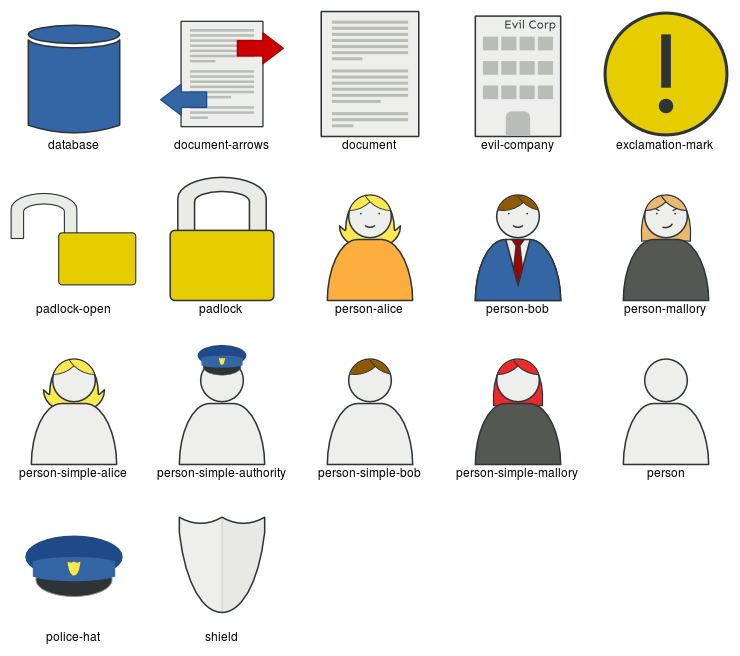

Crypto Icons
============
A collection of hand-made Scalable Vector Graphics icons, useful for
representing cryptographic schemes and protocols or to create figures
explaining something in cryptography.
The icons can be freely used in any presentation or publication **even
without** acknowledgment/attribution.

Naming convention
-----------------
I choose use descriptive naming for the icons and not to use metaphors.
E.g., the padlock icon is called `padlock` and not `encryption`.

Help Wanted
-----------
I am not designer, nor do I have all the time of the world.
If you have ideas or would like to help, please open a pull request or
create a new issue.
If you cannot modify `svg` by hand, please open an issue for support.
